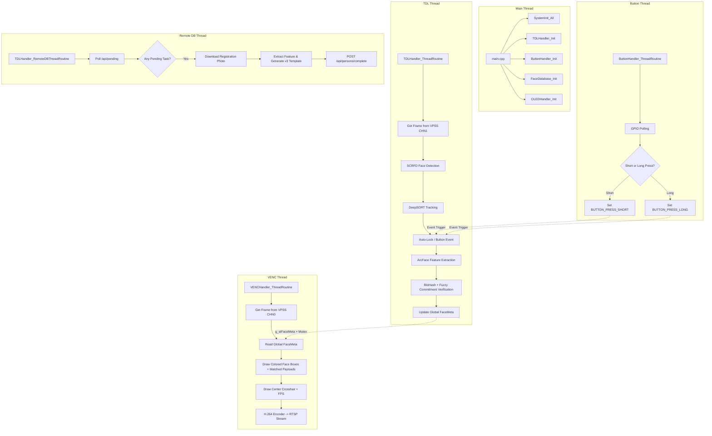

# gmailk-V

[English](#english) | [中文](#chinese) | [Project Status](docs/PROJECT_STATUS.md) | [Quick Start](QUICKSTART.md)

---

<a name="english"></a>
## English

### Overview

**gmailk-V** is a high-performance, privacy-preserving face detection and recognition system designed for the **CVITEK CV181X/CV180X RISC-V** embedded platform (e.g., Milk-V Duo 256M). By combining real-time AI inference on the TPU with the **Fuzzy Commitment v3** template protection scheme (BioHash + BCH error-correcting codes), the system ensures **zero raw face features are ever stored** in the database. 

Additionally, the system features seamless integration with a **Raspberry Pi FastAPI backend** via USB CDC-NCM, allowing mobile web-based enrollment and template management, alongside real-time feedback on a **1.51" transparent SPI OLED display**.

---

### Core Features

*   🎯 **Real-time Face Processing** — SCRFD face detection and DeepSORT tracking running on the CVITEK TDL SDK (TPU-accelerated).
*   🧠 **TPU Face Recognition** — ArcFace 512-dimensional feature extraction running on the CVI TPU (`.cvimodel` format).
*   🔐 **Fuzzy Commitment v3 (Privacy-Preserving)** — 
    *   **2048-Dim Projection**: ArcFace features are projected using a $2048 \times 512$ pseudo-random matrix (4x dimension expansion).
    *   **Reliable Bit Selection**: The 511 most stable projection bits are selected as the face fingerprint ($B$).
    *   **Secure Sketch**: A 128-bit random key $K$ is generated and encoded using BCH ($GF(2^9), n=511, t=42$). The sketch $\delta = B \oplus \text{BCH\_encode}(K)$ hides both $K$ and $B$, eliminating standard Systematic BCH plaintext leakage.
    *   **Payload Encryption**: User metadata is encrypted using AES-128-CTR and verified using HMAC-SHA256 (Encrypt-then-MAC) with key $K$.
    *   **Stateless Auto-Expiration**: Time-based seeds (`YYYYMMDDHHmm`) automatically revoke templates after ~1 month.
*   🍓 **Raspberry Pi Remote Database** —
    *   **Web UI**: Responsive HTML5/JS single-page frontend for registering users and managing templates.
    *   **FastAPI Backend**: Python FastAPI server utilizing SQLite (`aiosqlite`) for template and metadata storage.
    *   **Asynchronous Enrollment Queue**: A dedicated CV181X background thread polls `/api/pending` for uploaded images, performs TPU extraction & Fuzzy Commitment, and posts completed templates back to the server.
    *   **Local Fallback**: Automatically caches templates (30s TTL) and falls back to a local JSON database (`data/face_database.json`) if the connection is lost.
*   📹 **RTSP Streaming** — H.264 1280×720 video feed with live colored face overlays:
    *   🔴 **Red Box**: Locked/Selected face (ready for identification or registration).
    *   🟡 **Yellow Box**: Center face (auto-locking in progress).
    *   🟢 **Green Box**: Stable tracked face.
    *   🔵 **Blue Box**: Unstable tracked or new face.
*   🔘 **Hardware Interaction** — 
    *   **Waveshare 1.51" Transparent OLED (SPI)**: Displays center crosshair, face bounding boxes mapped to 128x64 resolution, FPS, and decrypted payload details (Name | Description).
    *   **GPIO Button (Pin 21)**: Short press triggers manual re-identification; long press (>3s) registers the currently locked face.
    *   **GPIO LED (Pin 25)**: Status indicator for button presses.
*   🚀 **Multi-threaded Architecture** — Concurrent execution of AI inference (TDL), H.264 encoding (VENC), button polling, and background remote database operations.

---

### Project Structure

```
gmailk-V/
├── CMakeLists.txt              # Top-level CMake, links bch_codec, crypto, and oled
├── Makefile                    # Simple build wrapper
├── build.sh                    # Multi-option cross-compile script (RISC-V musl)
├── config.json                 # Runtime configuration file
├── envsetup.sh                 # Environment setup script
├── QUICKSTART.md               # Quick start operational guide
├── LICENSE                     # MIT License
│
├── src/                        # C++ Source Files (11 files)
│   ├── main.cpp                # Entry point, initialization, and thread management
│   ├── shared_data.cpp         # Thread-safe global shared data with mutexes
│   ├── system_init.cpp         # VI/VPSS/VENC/RTSP middleware initialization
│   ├── tdl_handler.cpp         # Face detect, track, feature extraction & Fuzzy Commitment
│   ├── venc_handler.cpp        # H.264 video encoding, RTSP streaming, and OSD drawing
│   ├── button_handler.cpp      # GPIO button polling (short/long press)
│   ├── biohash_processor.cpp   # Core BioHash + BCH + Fuzzy Commitment v3 algorithms
│   ├── face_database.cpp       # Local JSON face database (local backup)
│   ├── face_feature_extractor.cpp # ArcFace TPU inference runner
│   ├── oled_ctrl.cpp           # Waveshare 1.51" transparent SPI OLED display driver
│   ├── remote_database.cpp     # RPi FastAPI client wrapper (cpp-httplib)
│   ├── helpers/                # Header-only helper modules
│   │   ├── auto_lock_helper.hpp   # Auto-locks faces near center (3s dwell)
│   │   ├── btn_helpers.hpp        # Button short/long press actions
│   │   ├── fps_helper.hpp         # Real-time FPS calculation
│   │   ├── geometry_helper.hpp    # Checks distance to center crosshair
│   │   └── oled_helper.hpp        # Translates face coordinates and handles OLED updates
│   ├── 3rdparty/               # Pre-bundled third-party libraries
│   │   ├── bch/                # BCH error-correction code library (bch_codec.c/h)
│   │   ├── sha256/             # Brad Conte minimal SHA-256 implementation
│   │   ├── tiny-AES-C/         # Tiny AES library for AES-128-CTR encryption
│   │   ├── httplib/            # Header-only cpp-httplib client
│   │   └── json/               # Header-only nlohmann/json parser
│   └── drivers/
│       └── ssd1306/            # Legacy I2C SSD1306 driver (Deprecated)
│
├── include/                    # C++ Header Files (13 files)
├── models/                     # TPU Model Files (.cvimodel)
│   ├── scrfd_det_face_432_768_INT8_cv181x.cvimodel
│   ├── arcface_cv181x_int8_sym.cvimodel
│   └── arcface_cv181x_bf16.cvimodel
│
├── gmailk-VVeb/                # Raspberry Pi Web Application
│   ├── index.html              # Single-page HTML/JS responsive dashboard
│   └── py/                     # Python FastAPI server
│       ├── main.py             # FastAPI entry point, SQLite DB setup, and HTTP endpoints
│       ├── pyproject.toml      # Dependency definitions managed by uv
│       └── uploads/            # Location for uploaded registration photos
│
├── docs/                       # Project Documentation
│   ├── PROJECT_STATUS.md       # Overall status and feature tracker
│   ├── RPI_ARCHITECTURE.md     # RPi interaction API and CDC-NCM configuration
│   ├── FACE_DERIVED_KEY_CONCEPT.md # Cryptographic Fuzzy Commitment design details
│   ├── BCH_QUANTITATIVE_ANALYSIS.md # Parameter evaluation and EER optimization
│   └── FACE_RECOGNITION_DEBUG.md # Debug notes for TPU and memory leakage
│
├── common/                     # Shared C middleware and sample utilities
├── lib/                        # Pre-compiled platform libraries (OpenCV, Media SDK, TDL SDK)
└── tools/                      # Cross-compile cmake files, compiler, and build utilities
```

---

### Threading Architecture



---

### Building the Project

The cross-compilation is driven by the `./build.sh` script using the RISC-V musl toolchain.

```bash
# Display all compilation options
./build.sh -h

# Build with default configuration (CV181X, Release build, multithreading)
./build.sh

# Rebuild from scratch (cleans the build directory first)
./build.sh -re

# Build for the CV180X target chip
./build.sh --chip CV180X

# Build debug binaries
./build.sh -d

# Clean build artifacts only
./build.sh -c
```

---

### Running the Application

Once deployed to the CV181X board:

```bash
# 1. Detection only
./main models/scrfd_det_face_432_768_INT8_cv181x.cvimodel

# 2. Detection + TPU ArcFace Recognition (Local JSON Database)
./main models/scrfd_det_face_432_768_INT8_cv181x.cvimodel models/arcface_cv181x_int8_sym.cvimodel

# 3. Detection + TPU Recognition + Waveshare 1.51" SPI OLED
./main models/scrfd_det_face_432_768_INT8_cv181x.cvimodel models/arcface_cv181x_int8_sym.cvimodel --oled

# 4. Detection + TPU Recognition + SPI OLED + RPi Remote Database (Default URL: http://192.168.42.1:3000)
./main models/scrfd_det_face_432_768_INT8_cv181x.cvimodel models/arcface_cv181x_int8_sym.cvimodel --oled --rpi

# 5. Connect to a custom RPi endpoint URL
./main models/scrfd_det_face_432_768_INT8_cv181x.cvimodel models/arcface_cv181x_int8_sym.cvimodel --oled --rpi http://192.168.42.1:8000
```

To view the RTSP stream overlay:
```bash
# Using VLC
vlc rtsp://<device-ip>:554/h264

# Using ffplay
ffplay rtsp://<device-ip>:554/h264
```

---

### Hardware Pinout

| Pin Name | Physical Connection | Functionality | Notes |
| :--- | :--- | :--- | :--- |
| **GPIO 21** | Button pin | Polled input, Active LOW | Triggers identification (short) / registration (long) |
| **GPIO 25** | LED pin | Output drive | Toggles on and off with each button press |
| **SPI Interface** | Waveshare 1.51" OLED | Display bus | CS, RST, DC, DIN (SDA), CLK (SCL) pins mapped via SPI |
| **Camera MIPI** | Camera sensor | Video input (VI) | Rotated 180° (mirror + flip) in VPSS configuration |

---

### Fuzzy Commitment Parameters

| Parameter | Value | Description |
| :--- | :--- | :--- |
| `BIOHASH_FEATURE_DIM` | 512 | Input feature dimension from ArcFace model |
| `BIOHASH_PROJ_DIM` | 2048 | Output dimension after $2048 \times 512$ projection matrix multiplication |
| `BIOHASH_K` | 511 | Codeword length $n$, representing the most stable bits selected |
| `BCH_M` | 9 | Galois Field size $GF(2^9)$ for BCH encoding |
| `BCH_T` | 42 | Error-correcting capability (tolerates up to 42 flipped bits, genuine max is ~14) |
| `BIOHASH_KEY_BYTES` | 16 | Length of the random cryptographic key $K$ (128 bits) |

---

<a name="chinese"></a>
## 中文

請參閱 [docs/lang/README_ch.md](docs/lang/README_ch.md) 取得完整中文專案說明文件。  
若要快速啟動，請閱讀 [QUICKSTART.md](QUICKSTART.md)。
