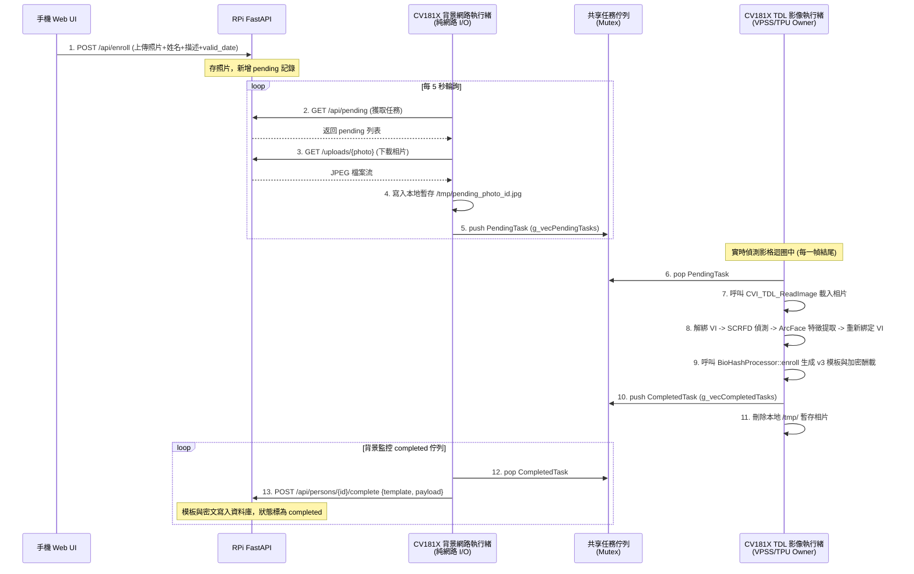

# 樹莓派遠端資料庫與邊緣端整合架構 (Remote Database & API Integration)

> **最後更新**：2026-06-12  
> **連線協議**：USB CDC-NCM 虛擬網卡直連 (RPi: `192.168.42.2`, CV181X: `192.168.42.1`)

---

## 1. 網路拓撲與連接設定

我們利用 **USB OTG** 介面，在 **CV181X** 設備與 **Raspberry Pi** 之間建立 **CDC-NCM** 虛擬區域網路連線。

```
  ┌───────────────────────┐                 ┌───────────────────────┐
  │   CV181X (邊緣裝置)   │    USB OTG      │   Raspberry Pi (Srv)  │
  │   IP: 192.168.42.1    ├─────────────────┤   IP: 192.168.42.2    │
  │   運行 C++ 辨識程式   │    (CDC-NCM)    │   運行 FastAPI (P3000)│
  └───────────────────────┘                 └───────────────────────┘
```

### 邊緣端 (CV181X) 網卡配置
在 `/etc/network/interfaces` 中加入：
```ini
auto usb0
iface usb0 inet static
    address 192.168.42.1
    netmask 255.255.255.0
    gateway 192.168.42.2
```

---

## 2. 樹莓派 FastAPI 服務與資料庫

樹莓派端使用 Python FastAPI 框架與 SQLite 進行輕量化元數據管理：
*   **資料庫路徑**：`gmailk-VVeb/py/gvw.db`
*   **照片暫存目錄**：`gmailk-VVeb/py/uploads/`
*   **啟動指令**：`cd gmailk-VVeb/py && uv run python main.py`

### 2.1 SQLite 資料表結構
```sql
CREATE TABLE persons (
    id                INTEGER PRIMARY KEY AUTOINCREMENT,
    name              TEXT NOT NULL,
    description       TEXT DEFAULT '',         -- 酬載明文來源 (如部門、編號)
    photo_path        TEXT DEFAULT '',         -- 註冊相片之暫存檔名
    valid_date        TEXT DEFAULT '',         -- 12 位時間戳 (YYYYMMDDHHmm)
    status            TEXT DEFAULT 'pending',  -- pending (待註冊) / completed (已註冊)
    biohash_template  TEXT DEFAULT '',         -- CV181X 產出之 v3 模板 hex
    encrypted_payload TEXT DEFAULT '',         -- CV181X 產出之對稱加密密文 hex
    created_at        TEXT DEFAULT (datetime('now')),
    updated_at        TEXT DEFAULT (datetime('now'))
);
```

---

## 3. REST API 介面規格

### 3.1 Web UI 路由
*   **`GET /`**：回傳響應式管理後台 Web UI 網頁 (`index.html`)。
*   **`GET /uploads/{filename}`**：提供上傳的註冊相片靜態讀取（防範 `..` 目錄遍歷）。

### 3.2 註冊與模板同步 (裝置端 API)
*   **`POST /api/enroll`**：Web UI 註冊表單提交。上傳人臉照片、設定姓名、有效日期與描述，建立 `pending` 記錄。
*   **`GET /api/pending`**：CV181X 背景執行緒專用。輕量化獲取所有 `pending` 狀態的任務：
    *   回傳：`[{ "id", "name", "photo_path", "valid_date", "description" }]`
*   **`POST /api/persons/{id}/complete`**：CV181X 完成 AI 提取與模板計算後回傳：
    *   請求 Body：`{ "biohash_template": "...", "encrypted_payload": "..." }`
    *   效果：更新 status 為 `completed`，寫入模板與密文。
*   **`POST /api/persons`**：CV181X 直接註冊（長按硬體按鈕）。不上傳照片，直接寫入 `completed` 狀態的模板。
*   **`GET /api/templates`**：CV181X 同步用。僅拉取已完成 (`completed`) 且有模板的列表。

### 3.3 人員管理 (CRUD) 與狀態
*   **`GET /api/persons`**：列出資料庫所有記錄（含 pending）。
*   **`GET /api/persons/{id}`**：查詢單一使用者。
*   **`PUT /api/persons/{id}`**：變更姓名或描述。
*   **`DELETE /api/persons/{id}`**：刪除人員，並同步刪除樹莓派上的實體照片。
*   **`GET /api/status`**：回傳服務運行時間、註冊人數與資料庫連接狀態。

---

## 4. 邊緣端非同步任務佇列 (Async Queue)

為避免實時人臉辨識（30 FPS）在處理「下載照片、特徵提取、HTTP 模板上傳」等慢速網路 I/O 時產生卡頓，我們採用了**雙佇列執行緒分離架構**。

### 4.1 資料流時序圖



### 4.2 關鍵工程細節

1.  **影像解碼脫離 VPSS 管線**：
    早期使用 `CVI_TDL_StbReadImage` 會佔用 VPSS 進行硬體轉碼，導致與 VI 實時串流產生衝突崩庫。實作中改用 `CVI_TDL_ReadImage` + `imgprocess_t`。該 API 使用 OpenCV CPU 解碼照片為 `RGB_888_PLANAR`，完全不依賴或干擾 VPSS 綁定狀態。
2.  **人臉偵測短解綁機制**：
    雖然照片載入脫離 VPSS，但 SCRFD 人臉偵測模型在 TPU 上的前處理仍依賴 VPSS。因此，在 TDL Thread 執行註冊時，會短暫 UnBind VPSS (約 100ms)，提取完畢後立即 ReBind。這會使 RTSP 串流有極微弱的幀跳動，但絕不影響系統實時運行。
3.  **30 秒快取 TTL 控制**：
    為避免每幀比對時頻繁發送 HTTP 請求拖慢辨識速度，C++ 客戶端在 `remote_database.cpp` 中維護了 30s TTL 本地快取。只有在快取失效或本地 fallback 觸發時，才會發送實體 HTTP GET 同步模板。
4.  **重複下載與路徑防呆**：
    背景網路執行緒維護 `attempted_ids` 集合，過濾已處理之 ID。下載照片時自動 strip 檔名前綴，防止路徑錯誤。
