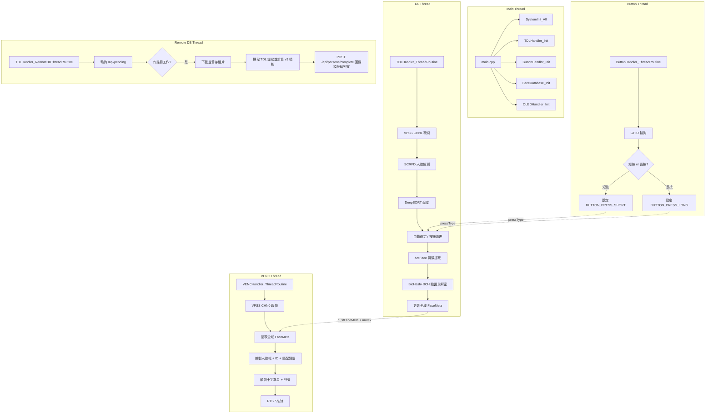

# gmailk-V 系統架構與專案全景 (System Architecture)

> **最後更新**：2026-06-12 (v3: 2048-dim 全域 XOR + BCH_T=42)

---

## 1. 專案概述

**gmailk-V** 是一個在 **CVITEK CV181X/CV180X RISC-V** 嵌入式平台上運行的**實時隱私保護人臉偵測與辨識系統**。其核心技術規格如下：

| 功能模組 | 技術實現 | 說明 |
|------|------|------|
| **人臉偵測** | SCRFD (CVI TDL SDK, TPU) | INT8 量化推理，實時偵測 |
| **人臉追蹤** | DeepSORT (卡爾曼濾波 + 匈牙利關聯) | 穩定 Track ID 關聯，防幀跳動 |
| **人臉辨識** | ArcFace (CVI TPU, 512 維特徵) | CVI NN Runtime 推理，L2 正規化 |
| **隱私保護** | BioHash + BCH + Fuzzy Commitment v3 | 投影至 2048 維，全域 511-bit XOR 遮蔽 |
| **加密酬載** | AES-128-CTR + HMAC-SHA256 (Encrypt-then-MAC) | 衍生金鑰 K 僅由人臉成功匹配時恢復，解鎖敏感數據 |
| **視訊串流** | H.264 RTSP (1280×720 @ 30 FPS) | 硬體 VENC 編碼，帶彩色 OSD 疊加框 |
| **硬體互動** | GPIO 按鈕、LED、Waveshare 1.51" OLED (SPI) | 十字準星、座標映射人臉框、狀態與解密酬載顯示 |
| **遠端同步** | USB CDC-NCM HTTP Client (cpp-httplib) | 輪詢 pending 佇列，30s TTL 本地快取，本地 JSON 備份 |

> [!IMPORTANT]
> 系統**不儲存原始人臉特徵**，僅儲存 Fuzzy Commitment sketch（$\delta = B \oplus C$）與 SHA-256 commitment。正確的人臉是恢復對稱金鑰 $K$ 解密酬載資訊的唯一鎖鑰。

---

## 2. 專案目錄結構

```
gmailk-V/
├── CMakeLists.txt              # 頂層 CMake 設定，連結 bch_codec、crypto 與 oled 驅動
├── build.sh                    # 交叉編譯腳本 (RISC-V musl)
├── config.json                 # 運行時配置文件
├── envsetup.sh                 # 環境變數設定腳本
├── QUICKSTART.md               # 快速使用操作指南
│
├── src/                        # C++ 原始碼 (11 個檔案)
│   ├── main.cpp                # 程式入口、系統初始化與執行緒管理
│   ├── shared_data.cpp         # 執行緒安全的執行緒同步與共享資料
│   ├── system_init.cpp         # VI/VPSS/VENC/RTSP 中間件初始化
│   ├── tdl_handler.cpp         # 人臉檢測、追蹤、特徵提取與 Fuzzy Commitment 驗證
│   ├── venc_handler.cpp        # H.264 視訊編碼、RTSP 伺服器與 OSD 繪圖
│   ├── button_handler.cpp      # GPIO 按鈕輪詢 (短按與長按)
│   ├── biohash_processor.cpp   # BioHash + BCH + Fuzzy Commitment v3 核心算法
│   ├── face_database.cpp       # 本地 JSON 人臉資料庫管理
│   ├── face_feature_extractor.cpp # ArcFace TPU 推理封裝
│   ├── oled_ctrl.cpp           # Waveshare 1.51" 透明 SPI OLED 控制
│   ├── remote_database.cpp     # 樹莓派 FastAPI 客戶端封裝 (cpp-httplib)
│   ├── helpers/                # 內聯輔助標頭檔 (auto_lock, btn, fps, geometry, oled)
│   ├── 3rdparty/               # 內建第三方依賴 (bch, sha256, tiny-AES-C, httplib, json)
│   └── drivers/
│       └── ssd1306/            # 舊版 I2C SSD1306 驅動 (已棄用)
│
├── include/                    # C++ 標頭檔 (13 個檔案)
├── models/                     # TPU 模型檔案 (.cvimodel)
├── gmailk-VVeb/                # 樹莓派 Web 應用程式 (FastAPI + SQLite + Web UI)
└── docs/                       # 專案設計文件
    ├── SYSTEM_ARCHITECTURE.md   # 本文件 (系統架構、目錄、執行緒、接線)
    ├── CRYPTOGRAPHY_DESIGN.md   # 密碼學設計 (Fuzzy Commitment v3, BCH 分析, 投影)
    └── REMOTE_DB_INTEGRATION.md # 樹莓派遠端資料庫整合 (REST API, 異步工作佇列, CDC-NCM)
```

---

## 3. 多執行緒協作架構

系統啟動後，共啟動了 **4 個主要執行緒**，透過互斥鎖 (Mutex) 保護全域變數，實現高吞吐量的資料傳遞。



### 共享資料結構 (shared_data.h)

為確保執行緒安全，所有跨執行緒資料存取均採用 Atomic 或 Mutex 保護：

| 全域變數 / 佇列 | 保護機制 | 用途 |
|----------|----------|------|
| `g_bExit` | `std::atomic<bool>` | 全域優雅退出信號 |
| `g_stFaceMeta` / `g_stTracker` | `g_ResultMutex` | TDL 執行緒傳遞實時偵測框與 Trace 資訊至 VENC |
| `g_iSelectedTrackID` | `g_SelectedTrackMutex` | 當前在準星中心被選中鎖定的 Trace ID |
| `g_mapTrackLockTime` | `g_LockTimeMutex` | 追蹤選中鎖定狀態之時間戳 |
| `g_mapTrackCenterTime` | `g_CenterTimeMutex` | 人臉於中心準星重疊計時 (自動選中計時) |
| `g_mapTrackFeatures` | `g_FeatureMutex` | 提取的人臉 512 維特徵向量 |
| `g_mapTrackMatchResults` | `g_MatchResultMutex` | Fuzzy Commitment v3 匹配與酬載解密結果 |
| `g_fCurrentFPS` | `g_FPSMutex` | RTSP 實時運行幀率 |
| `g_vecPendingTasks` | `g_PendingTaskMutex` | 遠端註冊下載任務排入，等待 TDL 執行緒處理 |
| `g_vecCompletedTasks` | `g_CompletedTaskMutex` | TDL 執行緒處理完成之模板，等待背景網路執行緒上傳 |

---

## 4. 核心業務流程

1.  **實時偵測與鎖定 (TDL Thread)**：
    *   從 VPSS 頻道 1 取得 $1280 \times 720$ NV21 畫面。
    *   透過 SCRFD TPU 推理進行人臉檢測。
    *   利用 DeepSORT 將人臉連結至穩定的 `Track ID`。
    *   **中心自動鎖定**：計算人臉相較於畫面中心準星的距離。若人臉位於中心且持續 3 秒，系統會將其設為選中狀態 (畫面框由綠轉紅，OLED 同步)。
2.  **特徵提取與驗證**：
    *   若有被鎖定之人臉且觸發辨識 (GPIO 按鈕短按或定時輪詢)，呼叫 ArcFace TPU 提取該臉部 512 維正規化特徵。
    *   以當前時間為基準生成 5 個滑動窗口時間種子 (`YYYYMMDDHHmm`)，重建投影矩陣。
    *   取得所有已同步的驗證模板，對各模板進行解遮蔽、BCH 糾錯解碼以恢復金鑰 $K^*$。
    *   計算 $\text{SHA-256}(K^*)$ 並比對模板中的 commitment。一致則身分驗證成功，並以 $K^*$ 解密 `encrypted_payload`。
3.  **視訊推流與繪圖 (VENC Thread)**：
    *   獲取 VPSS 頻道 0 畫面，依據比對結果於視訊上繪製彩色人臉框（紅色：選中，黃色：中心計時，綠色：穩定，藍色：新目標）。
    *   若辨識成功，於人臉框上方繪製解密後的酬載明文 (姓名 | 描述)。
    *   繪製畫面中心十字準星與 FPS，硬體編碼為 H.264 並推流至 RTSP。
4.  **SPI OLED 顯示**：
    *   `oled_ctrl` 定時更新 Waveshare 1.51" OLED 透明螢幕 (10 FPS 限制，防閃爍)。
    *   將 $1280 \times 720$ 人臉框坐標等比例映射至 $128 \times 64$ 物理螢幕，並在左上角滾動顯示最新辨識姓名與解密描述。

---

## 5. 硬體連接與接腳配置

| 開發板實體接腳 (Duo 256M) | 連接硬體組件 | 功能說明 | 備註 |
|:---|:---|:---|:---|
| **GPIO 21** | 實體輕觸按鈕 | 輸入，內部上拉 (Active LOW) | 短按：重新辨識<br/>長按 >3s：註冊鎖定人臉 |
| **GPIO 25** | LED 指示燈 | 輸出驅動 (Active HIGH) | 每次按鍵按下時，LED 切換亮滅狀態 |
| **SPI_CS** | Waveshare 1.51" OLED | 片選信號 | SPI 通訊時序控制 |
| **SPI_CLK** | Waveshare 1.51" OLED | 時脈輸入 | SPI 通訊時序控制 |
| **SPI_DIN / MOSI** | Waveshare 1.51" OLED | 資料輸入 | SPI 通訊時序控制 |
| **GPIO_DC** | Waveshare 1.51" OLED | 資料/命令控制腳 | SPI 控制專用 |
| **GPIO_RST** | Waveshare 1.51" OLED | 復位腳 | 初始化重置專用 |
| **Camera MIPI** | Camera Sensor | 視訊輸入 (VI) | 鏡頭在配置中做 180° 旋轉 (mirror + flip) |

---

## 6. 建構與部署執行

### 交叉編譯 (RISC-V musl)
```bash
./build.sh         # 預設建置 (CV181X, Release)
./build.sh -re     # 清理並重建
./build.sh -d      # 建置 Debug 版本
./build.sh -c      # 僅清理編譯暫存檔
```

### 部署至邊緣端執行
```bash
# 連接樹莓派遠端資料庫 (預設 HTTP://192.168.42.2:3000) 並開啟 OLED
./main models/scrfd_det_face_432_768_INT8_cv181x.cvimodel models/arcface_cv181x_int8_sym.cvimodel --oled --rpi

# 觀看 RTSP 實時串流畫面 (本機或區域網路)
vlc rtsp://<Duo_IP>:554/h264
```
