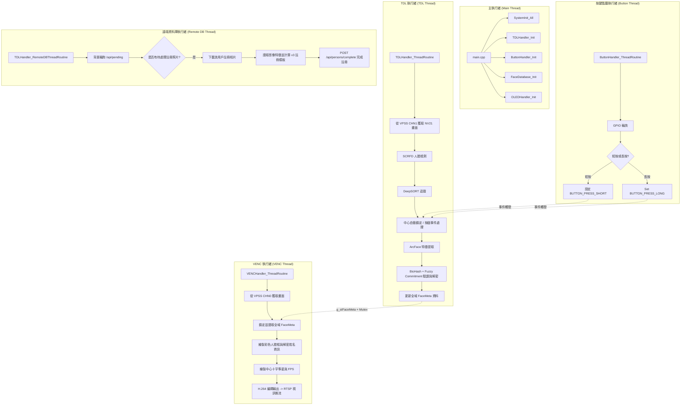

# gmailk-V 中文專案說明文件

[English](../../README.md) | [中文](#) | [系統架構與專案全景](../SYSTEM_ARCHITECTURE.md) | [快速使用指南](../../QUICKSTART.md)

---

### 專案概述

**gmailk-V** 是一個針對 **CVITEK CV181X/CV180X RISC-V** 嵌入式平台（如 Milk-V Duo 256M）設計的高效能、隱私保護人臉檢測與辨識系統。系統將 TPU 加速的即時 AI 推理與 **Fuzzy Commitment v3** 模板保護方案（BioHash + BCH 糾錯碼）相結合，確保**資料庫中絕對不儲存原始人臉特徵向量**。

此外，系統支援透過 USB CDC-NCM 連接的 **Raspberry Pi 樹莓派 FastAPI 後端**，提供手機友好的 Web UI 進行遠端註冊與模板管理，並配備 **1.51 吋透明 SPI OLED 顯示器**提供即時的視覺回饋。

---

### 核心功能特色

*   🎯 **即時人臉處理** — 基於 CVITEK TDL SDK 的 TPU 加速 SCRFD 人臉檢測與 DeepSORT 穩定追蹤。
*   🧠 **TPU 人臉辨識** — 基於 CVI TPU 的 ArcFace 512 維特徵提取，使用高效率的 `.cvimodel` 格式。
*   🔐 **Fuzzy Commitment v3 隱私保護** — 
    *   **2048 維投影**：ArcFace 512 維特徵與 $2048 \times 512$ 的偽隨機矩陣相乘（4 倍維度擴展），以確保特徵穩定性。
    *   **可靠位元選擇**：挑選投影後最穩定的 511 個位元作為人臉指紋（$B$）。
    *   **安全 Sketch (草案)**：產生 128-bit 隨機金鑰 $K$，並使用 BCH ($GF(2^9), n=511, t=42$) 編碼。Sketch $\delta = B \oplus \text{BCH-encode}(K)$ 全域遮蔽了 $K$ 與 $B$，完全解決了傳統 Systematic BCH 明文校驗碼洩漏人臉指紋的漏洞。
    *   **加密酬載**：使用金鑰 $K$ 透過 AES-128-CTR + HMAC-SHA256（Encrypt-then-MAC）加密使用者詳細資料，只有正確的人臉才能恢復 $K$ 並解密。
    *   **無狀態自動過期**：基於時間的種子（`YYYYMMDDHHmm`）讓模板在約 1 個月後自動過期失效。
*   🍓 **樹莓派遠端資料庫** —
    *   **Web UI**：手機友好的單頁 HTML5/JS 響應式控制面板，用於註冊使用者照片與管理模板。
    *   **FastAPI 後端**：基於 Python FastAPI 與 SQLite (`aiosqlite`) 的模板與元數據管理服務。
    *   **異步註冊佇列**：CV181X 背景執行緒輪詢 `/api/pending` 下載新上傳的照片，在裝置端執行 TPU 特徵提取與 Fuzzy Commitment 註冊，並將完成的模板 POST 回傳伺服器。
    *   **本地 Fallback**：自動快取模板（30 秒 TTL），並在樹莓派離線時自動降級使用本地 JSON 資料庫（`data/face_database.json`）。
*   📹 **RTSP 視訊推流** — 輸出 H.264 1280×720 視訊，帶有即時彩色 OSD 疊加框：
    *   🔴 **紅色框**：已鎖定 / 選中的人臉（準備進行辨識或註冊）。
    *   🟡 **黃色框**：中心準星人臉（自動鎖定計時中）。
    *   🟢 **綠色框**：穩定追蹤中的人臉。
    *   🔵 **藍色框**：不穩定追蹤或剛進入畫面的新臉。
*   🔘 **硬體互動** — 
    *   **Waveshare 1.51" 透明 OLED (SPI)**：實時繪製中心十字準星、人臉框（座標映射 1280x720 → 128x64）、FPS 幀率與解密後的用戶資訊（姓名 | 描述）。
    *   **GPIO 按鈕 (Pin 21)**：短按觸發手動重新辨識；長按（>3秒）將當前鎖定人臉註冊至資料庫。
    *   **GPIO LED (Pin 25)**：按鍵按下的狀態指示燈。
*   🚀 **多執行緒架構** — AI 檢測與辨識 (TDL)、H.264 編碼 (VENC)、按鈕輪詢、背景遠端資料庫任務皆在獨立執行緒併行運行。

---

### 專案目錄結構

```
gmailk-V/
├── CMakeLists.txt              # 頂層 CMake 設定，連結 bch_codec、crypto 與 oled 驅動
├── Makefile                    # 簡易編譯包裝檔
├── build.sh                    # 交叉編譯腳本 (RISC-V musl)
├── config.json                 # 運行時配置文件
├── envsetup.sh                 # 環境變數設定腳本
├── QUICKSTART.md               # 快速使用操作指南
├── LICENSE                     # MIT 授權條款
│
├── src/                        # C++ 原始碼 (11 個檔案)
│   ├── main.cpp                # 程式入口、系統初始化與執行緒管理
│   ├── shared_data.cpp         # 執行緒安全的執行緒同步與共享資料
│   ├── system_init.cpp         # VI/VPSS/VENC/RTSP 中間件初始化
│   ├── tdl_handler.cpp         # 人臉檢測、追蹤、特徵提取與 Fuzzy Commitment 驗證
│   ├── venc_handler.cpp        # H.264 視訊編碼、RTSP 伺服器與 OSD 繪圖
│   ├── button_handler.cpp      # GPIO 按鈕輪詢 (短按與長按)
│   ├── biohash_processor.cpp   # BioHash + BCH + Fuzzy Commitment v3 核心算法
│   ├── face_database.cpp       # 本地 JSON 人臉資料庫管理
│   ├── face_feature_extractor.cpp # ArcFace TPU 推理封裝
│   ├── oled_ctrl.cpp           # Waveshare 1.51" 透明 SPI OLED 控制
│   ├── remote_database.cpp     # 樹莓派 FastAPI 客戶端封裝 (cpp-httplib)
│   ├── helpers/                # 內聯輔助標頭檔
│   │   ├── auto_lock_helper.hpp   # 畫面中心自動鎖定邏輯 (3秒停留)
│   │   ├── btn_helpers.hpp        # 按鈕短按與長按對應操作
│   │   ├── fps_helper.hpp         # 實時 FPS 計算
│   │   ├── geometry_helper.hpp    # 計算目標到準星的距離
│   │   └── oled_helper.hpp        # OLED 坐標轉換與更新
│   ├── 3rdparty/               # 內建第三方依賴
│   │   ├── bch/                # BCH 糾錯碼函式庫 (bch_codec.c/h)
│   │   ├── sha256/             # Brad Conte 輕量 SHA-256 實作
│   │   ├── tiny-AES-C/         # 輕量 AES-128-CTR 加密實作
│   │   ├── httplib/            # 標頭檔 cpp-httplib 客戶端
│   │   └── json/               # 標頭檔 nlohmann/json 解析器
│   └── drivers/
│       └── ssd1306/            # 舊版 I2C SSD1306 驅動 (已棄用)
│
├── include/                    # C++ 標頭檔 (13 個檔案)
├── models/                     # TPU 模型檔案 (.cvimodel)
│   ├── scrfd_det_face_432_768_INT8_cv181x.cvimodel
│   ├── arcface_cv181x_int8_sym.cvimodel
│   └── arcface_cv181x_bf16.cvimodel
│
├── gmailk-VVeb/                # 樹莓派 Web 應用程式
│   ├── index.html              # 單頁 HTML/JS 手機端管理控制面板
│   └── py/                     # Python FastAPI 伺服器
│       ├── main.py             # 伺服器入口、SQLite 資料庫配置與 API 端點
│       ├── pyproject.toml      # uv 依賴定義
│       └── uploads/            # 用戶上傳註冊照片儲存目錄
│
├── docs/                       # 專案設計文件
│   ├── SYSTEM_ARCHITECTURE.md  # 系統架構、執行緒協作與硬體接線說明
│   ├── CRYPTOGRAPHY_DESIGN.md   # BioHash, BCH 糾錯碼與 Fuzzy Commitment v3 密碼學設計
│   └── REMOTE_DB_INTEGRATION.md # 樹莓派遠端資料庫, REST API 與異步佇列
│
├── common/                     # 共享 C 中間件與示例工具
├── lib/                        # 預編譯的平台庫 (OpenCV, Media SDK, TDL SDK)
└── tools/                      # 交叉編譯 cmake 設定、編譯器與建置腳本
```

---

### 執行執行緒架構



---

### 編譯專案

我們使用 `./build.sh` 配合 RISC-V musl 交叉編譯工具鏈來建置專案。

```bash
# 顯示所有編譯選項
./build.sh -h

# 預設建置 (CV181X, Release 版本, 多核並行編譯)
./build.sh

# 清理並重新編譯
./build.sh -re

# 為 CV180X 晶片進行編譯
./build.sh --chip CV180X

# 建置 Debug 偵錯版本
./build.sh -d

# 僅清理編譯暫存檔
./build.sh -c
```

---

### 執行應用程式

部署至 CV181X 開發板後，可依需求指定不同參數執行：

```bash
# 1. 僅啟用人臉檢測功能
./main models/scrfd_det_face_432_768_INT8_cv181x.cvimodel

# 2. 啟用檢測與 TPU ArcFace 辨識 (使用本地 JSON 資料庫)
./main models/scrfd_det_face_432_768_INT8_cv181x.cvimodel models/arcface_cv181x_int8_sym.cvimodel

# 3. 啟用檢測、辨識，並輸出至 1.51" 透明 SPI OLED
./main models/scrfd_det_face_432_768_INT8_cv181x.cvimodel models/arcface_cv181x_int8_sym.cvimodel --oled

# 4. 啟用檢測、辨識、SPI OLED，並同步樹莓派遠端資料庫（預設連線 URL: http://192.168.42.2:3000）
./main models/scrfd_det_face_432_768_INT8_cv181x.cvimodel models/arcface_cv181x_int8_sym.cvimodel --oled --rpi

# 5. 連接自訂 IP 的樹莓派伺服器
./main models/scrfd_det_face_432_768_INT8_cv181x.cvimodel models/arcface_cv181x_int8_sym.cvimodel --oled --rpi http://192.168.42.2:8000
```

觀看即時 RTSP 畫面：
```bash
# 使用 VLC
vlc rtsp://<設備IP>:554/h264

# 使用 ffplay
ffplay rtsp://<設備IP>:554/h264
```

---

### 硬體接線說明

| 腳位名稱 | 實體連接 | 功能說明 | 備註 |
| :--- | :--- | :--- | :--- |
| **GPIO 21** | 按鈕輸入 | 內部上拉，按下為 LOW | 用於重新辨識（短按）與註冊（長按） |
| **GPIO 25** | LED 輸出 | 輸出驅動 | 按鍵按下時，LED 狀態隨之切換 |
| **SPI 總線** | Waveshare 1.51" OLED | 顯示數據傳輸 | 包括 CS, RST, DC, DIN (SDA), CLK (SCL) 腳位 |
| **Camera MIPI** | 相機鏡頭 | 視訊輸入 (VI) | 在 VPSS 配置中已做 180° 旋轉 (flip + mirror) |

---

### Fuzzy Commitment v3 關鍵參數

| 參數 | 數值 | 說明 |
| :--- | :--- | :--- |
| `BIOHASH_FEATURE_DIM` | 512 | ArcFace 人臉特徵向量維度 |
| `BIOHASH_PROJ_DIM` | 2048 | 隨機投影後的維度大小（4 倍維度擴展） |
| `BIOHASH_K` | 511 | BCH 編碼長度 $n$，挑選最穩定的二值化位元長度 |
| `BCH_M` | 9 | BCH 運算的伽羅瓦體 $GF(2^9)$ |
| `BCH_T` | 42 | 可糾正的最大位元錯誤數（理論值 42 bit，正臉實測錯誤數約為 14） |
| `BIOHASH_KEY_BYTES` | 16 | 128 位元隨機加密金鑰 $K$ 的長度 |
